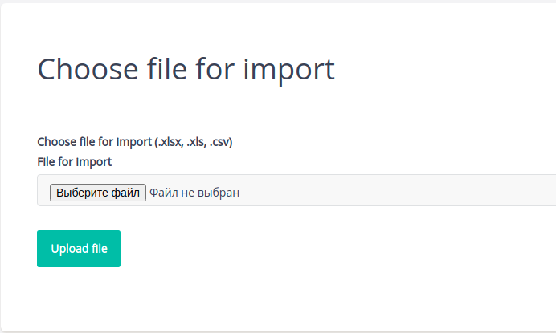
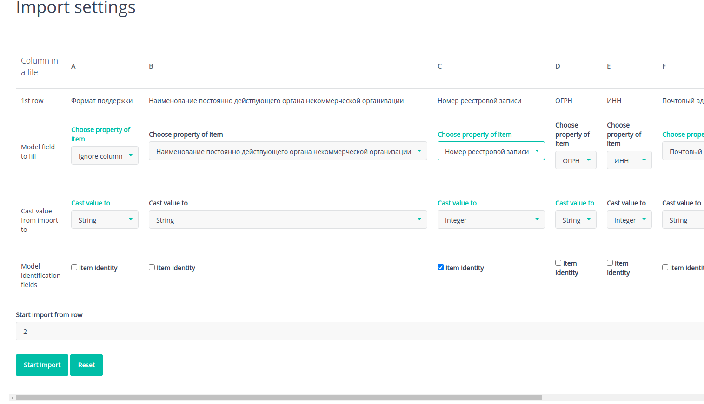
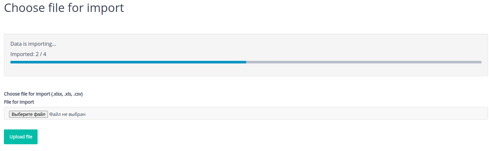

[](https://packagist.org/packages/elfuvo/yii2-import-wizard) 
[](https://github.com/elfuvo/yii2-import-wizard)
[](https://github.com/elfuvo/yii2-import-wizard/blob/master/LICENSE)
[](http://www.yiiframework.com/)

##### Table of Contents
[Requirements](#requirements)<br />
[Installation](#installation)<br />
[Configure](#configure)
 - [Module common configuration](#configure)
 - [I18n messages](#i18n)
 - [Actions](#actions)
    + [Upload import file action](#upload-import-file-action)
    + [Upload import file action with pre-defined attribute map](#upload-import-file-action-with-pre-defined-attribute-map)
    + [Import setup action](#import-setup-action)
    + [Current progress action](#current-progress-action)

[Queue job](#queue-job)<br />
[Import link button](#import-link-button)<br />
[Additional notes](#additional-notes)<br />
[Screenshots](#screenshots)

## Requirements

* PHP >=7.1

## Installation

The preferred way to install this extension is through [composer](http://getcomposer.org/download/).

Either run

```
php composer.phar require --prefer-dist elfuvo/yii2-import-wizard "~0.2.0"
```

or add

```
"elfuvo/yii2-import-wizard": "~0.2.0"
```

to the "require" section of your `composer.json` file.

## Configure

Configure service for importing, Importing result keeper and available import adapters.

```php
// in common app config
[
'container'=>[
    'definitions' => [
           \elfuvo\import\services\ImportServiceInterface::class => [
                'class' => \elfuvo\import\services\ImportService::class,
                'casters' => [
                    // there is a custom value casters 
                    // \elfuvo\import\services\BracketValueCaster::class,
                ]
            ],
            \elfuvo\import\result\ResultImportInterface::class =>
                \elfuvo\import\result\FileContinuesResultImport::class,
            \elfuvo\import\adapter\AdapterFabricInterface::class => [
                'class' => \elfuvo\import\adapter\AdapterFabricDefault::class,
                'adapters' => [
                    \elfuvo\import\adapter\AdapterImportExcel::class,
                    \elfuvo\import\adapter\AdapterImportCsv::class,
                ]
            ],    
        ],
    ],
];
```

## I18n
Add translations to i18n yii component:

```php
[
    'components' => [
        'i18n' => [
                'class' => \yii\i18n\I18N::class,
                'translations' => [
                    'import-wizard' => [
                        'class' => \yii\i18n\PhpMessageSource::class,
                        'sourceLanguage' => 'en',
                        'basePath' => '@vendor/elfuvo/yii2-import/src/messages',
                    ],
                ],
        ]
    ]
];
```
## Actions
Add import steps actions to your controller
```php
class DefaultController extend \yii\web\Controller{
    
    public function actions()
    {
        return [
            'upload-file-import' => [ // action with form for uploading import file
                'class' => \elfuvo\import\actions\UploadFileAction::class,
                ...
            ],
            'setup-import' => [ // action with import configuration form
                'class' => \elfuvo\import\actions\SetupAction::class,
                ...
            ],
            'progress' => [ // action for showing current import progress/statistic and errors after import is done
                'class' => \elfuvo\import\actions\ProgressAction::class,
            ],
        ];
    }
}

```

### Upload import file action

```php
    public function actions()
    {
        return [
            'upload-file-import' => [
                'class' => \elfuvo\import\actions\UploadFileAction::class,
                'model' => new Review(), // model instance for import
                'nextAction' => 'setup-import', // next action name
                'progressAction' => 'progress', // name of progress action
            ],
            ...
        ];
    }
```

### Upload import file action with pre-defined attribute map
If you are using attribute map, that you don't need configure setup action. Import starts after file uploaded. 

```php
    public function actions()
    {
        return [
            'upload-file-import-map' => [
                'class' => UploadFileAction::class,
                // model instance with pre-defined attribute values. It will be cloned in import service.
                // can be callable function that returns model
                'model' => new Review([
                    'language' => 'ru',
                    'hidden' => Review::HIDDEN_NO,
                ]),
                'view' => '@root/src/views/upload-file',
                'startRowIndex' => 2,
                // can be callable function that return array of MapAttribute models
                // first argument for that function is first row from import file
                'attributeMap' => [
                    new MapAttribute([
                        'column' => 'A',
                        'attribute' => 'b24StationId',
                        'castTo' => BracketValueCaster::class,
                    ]),
                    new MapAttribute([
                        'column' => 'B',
                        'attribute' => 'title',
                        'castTo' => MapAttribute::TYPE_STRING,
                        'identity' => 1,
                    ]),
                    new MapAttribute([
                        'column' => 'C',
                        'attribute' => 'author',
                        'castTo' => MapAttribute::TYPE_STRING,
                    ]),
                    new MapAttribute([
                        'column' => 'D',
                        'attribute' => 'text',
                        'castTo' => MapAttribute::TYPE_STRING,
                    ]),
                    new MapAttribute([
                        'column' => 'E',
                        'attribute' => 'rating',
                        'castTo' => MapAttribute::TYPE_FLOAT,
                    ]),
                    new MapAttribute([
                        'column' => 'F',
                        'attribute' => 'publishAt',
                        'castTo' => MapAttribute::TYPE_DATETIME,
                    ]),
                ],
                'progressAction' => 'progress',
            ],
        ];
   }
```

### Import setup action

```php
    public function actions()
    {
        return [
        ...
        'setup-import' => [
                'class' => \elfuvo\import\actions\SetupAction::class,
                // model instance with pre-defined attribute values. It will be cloned in import service.
                /*'model' => new Review([ 
                      'hidden' => Review::HIDDEN_NO,
                      'language' => Yii::$app->language,
                      'createdBy' => Yii::$app->user->getId(),
                ])*/
                // can be callable function
                'model' => function(){ 
                    $importModel = new Review([
                        'hidden' => Review::HIDDEN_NO,
                        'language' => Yii::$app->language,
                        'createdBy' => Yii::$app->user->getId(),
                    ]);
                    // some behaviors do not work in console app (for queued import)
                    // there we can disable them 
                    $importModel->detachBehavior('LanguageBehavior');
                    $importModel->detachBehavior('CreatedByBehavior');
                    
                    return $importModel;
                },                     
                'scenario' => Review::SCENARIO_DEFAULT, // scenario of model validation when saving model from import
                'previousAction' => 'upload-file-import', // previous action name
                'excludeAttributes' => [ // exclude model attributes for building import map
                    'id',
                    'language',
                    'createdBy',
                    'createdAt',
                    'updatedAt'
                ]
            ],
        ];
    )
```

### Current progress action
```php
    public function actions() {
        return [
            ...
            'progress' => [
                'class' => \elfuvo\import\actions\ProgressAction::class,
                'model' => new Review(),
            ],
        ];
    }
```

## Queue job
If queue component is not configured for Yii application then import will start immediately.
Otherwise `ImportJob` will be added to the task queue.

Yii2 [queue](https://github.com/yiisoft/yii2-queue/blob/master/docs/guide/README.md).


## Import link button
Add import link button into your module view:

```php
    <?= Html::a(Yii::t('import-wizard', 'Import models from Excel file'), ['upload-file-import'], [
         'class' => 'btn btn-primary'
    ]) ?>
```

## Additional notes

Model validation rules used as detection for casting value from import.
This actual for setup import action.
It is necessary to carefully consider validation of the model, 
as bad validation may lead to incorrect data insertion 
(for example: a date from Excel cannot be inserted as a date in MySql) and errors when inserting data into the database.

```php
    /**
     * @inheritdoc
     */
    public function rules()
    {
        return [
                [['rating'], 'double', 'min' => 1, 'max' => 5], // will add float converter in import wizard
                [['publishAt'], 'date', 'format' => 'yyyy-MM-dd HH:mm:ss'], // will add date converter in import wizard
        ];
    }

```

Important! Import file must have column(s) with unique (identity) values for updating existing models.

## Screenshots




